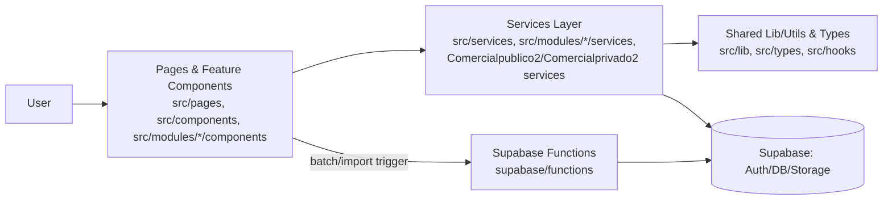
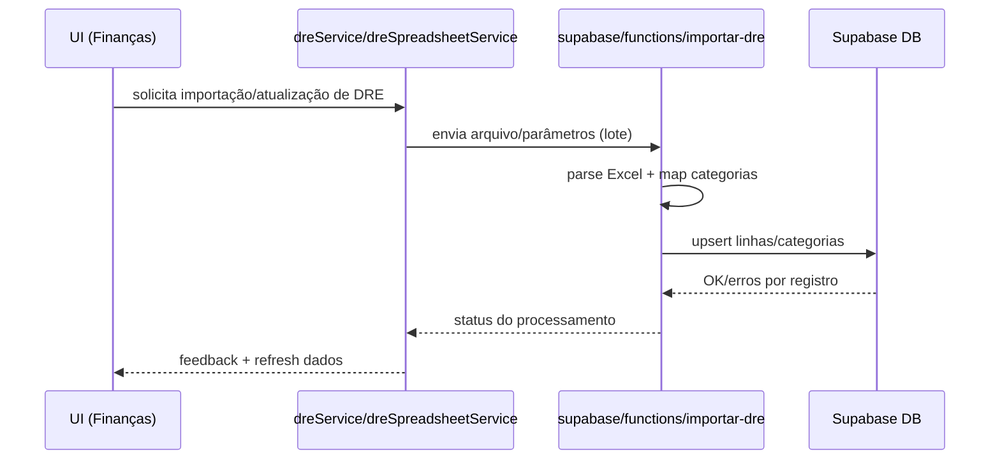

# Architecture

Este documento descreve a arquitetura do **wws-hub / wws-app** a partir da estrutura do repositório e dos padrões observados no código. O foco é orientar quem desenvolve e mantém o sistema: **como o código está organizado**, **como os módulos se relacionam**, **quais são as camadas** e **onde colocar mudanças**.

> Para uma visão mais completa de contagens, dependências e “mapa” do código, consulte: [`docs/codebase-map.json`](./codebase-map.json).

---

## Visão geral

O sistema é um **monólito modular**: um único repositório e (tipicamente) um único bundle/runtime de frontend, com **módulos por domínio** (Finanças, TI, Qualidade, Comercial Público/Privado etc.) organizados em pastas. A aplicação integra com **Supabase** (Postgres/Auth/Storage) e usa **Supabase Functions** para rotinas serverless/ETL (ex.: importação de DRE).

### Objetivos arquiteturais (implícitos)

- **Coesão por domínio**: cada domínio agrupa UI, tipos, serviços e utilitários.
- **Reuso por bibliotecas locais**: utilitários e services compartilhados.
- **Evolução independente por módulo**: domínios podem duplicar tipos/constantes quando a independência é mais valiosa que a padronização.
- **Processamento pesado fora do browser**: via Functions quando apropriado (ex.: Excel → DRE).

---

## Topologia e deployment (alto nível)

- **Frontend**: React + TypeScript (SPA/rotas), entregue como bundle estático.
- **Backend**: Supabase:
  - **DB** (Postgres) e **Auth**
  - **Storage** (quando aplicável)
  - **Edge/Serverless Functions** para processamento e integrações

---

## Fluxo típico (UI → dados)

1. Usuário interage com uma **página/feature** em `src/pages/` ou dentro de um módulo (ex.: `src/modules/financas/...`).
2. A página compõe **componentes** (ex.: `src/components/...`, `src/components/Comercialpublico2/...`, `src/components/Comercialprivado2/...`).
3. Componentes chamam **services** para buscar/atualizar dados e orquestrar regras (ex.: `src/services/*`).
4. Services usam **types** e **utils** para validação, cálculo, normalização e contratos.
5. Para operações batch/ETL (ex.: importação de DRE), o fluxo utiliza **Supabase Functions** em `supabase/functions/...`.

---

## Camadas arquiteturais

A separação é principalmente “por convenção de pasta”. Abaixo estão as camadas (com diretórios principais) e como elas devem ser usadas.

### 1) Presentation (UI / Pages / Feature Components)

Responsabilidade:
- Renderizar telas
- Compor componentes
- Tratar estados de UI (loading/empty/error)
- Disparar ações para services

Diretórios-chave:
- `src/pages/`
- `src/components/`
- `src/components/ui/` (UI kit/componentes base)
- `src/modules/*/components/`
- `src/components/Comercialpublico2/src/components/`
- `src/components/Comercialprivado2/src/components/`

Exemplos relevantes (muito importados):
- `src/components/Comercialpublico2/src/components/Dashboard/Dashboard.tsx`
- `src/components/Comercialprivado2/src/components/Dashboard/Dashboard.tsx`
- `src/pages/AtasAcoesPage.tsx`

Boas práticas:
- Evitar acesso direto ao Supabase no componente quando existir um service equivalente.
- Manter regra de negócio “leve” e local; mover orquestração para services.

---

### 2) Domain Modules (módulos por pasta)

Responsabilidade:
- Agrupar capacidades por domínio (Finanças, TI, Qualidade, Comercial etc.)
- Conter “subapps” (feature sets) com UI, serviços e tipos próprios

Diretórios-chave:
- `src/modules/financas/`
- `src/modules/ti/`
- `src/modules/qualidade/`
- `src/components/Comercialpublico2/`
- `src/components/Comercialprivado2/`

Notas importantes:
- **Comercial Público** e **Comercial Privado** possuem estruturas paralelas (UI/Services/Types/Hooks/Utils próprios), indicando intenção de **autonomia**.
- Há um subdomínio robusto de **Orçamentos** em:
  - `src/components/Comercialprivado2/src/components/Orçamentos/src/`

---

### 3) Application / Use-case Services (camada de serviços)

Responsabilidade:
- Acesso a dados (Supabase/HTTP)
- Orquestração de casos de uso
- Transformações e agregações
- Centralizar tratamento de erro e contratos de resposta

Diretórios-chave:
- `src/services/`
- `src/modules/financas/services/`
- `src/components/Comercialpublico2/src/services/`
- `src/components/Comercialprivado2/src/services/`

Exemplos de services (exportados):
- `AIChatService` — `src/services/aiChatService.ts`
- `DashboardService` — `src/services/dashboardService.ts`
- `DRESpreadsheetService` — `src/services/dreSpreadsheetService.ts`
- Funções em `src/services/dreService.ts` como:
  - `buscarDREPorContrato`
  - `listarContratosDRE`

Boas práticas:
- Tratar limites e falhas do backend aqui (timeouts, mensagens de erro, retries idempotentes quando necessário).
- Evitar services “Deus”: preferir separar por feature/subdomínio.

---

### 4) Shared Libraries & Utilities (funções puras e helpers)

Responsabilidade:
- Utilitários reutilizáveis (datas, moeda, cálculos, arrays)
- Helpers de UI (ex.: `cn`)
- Regras puras e determinísticas (sem I/O)

Diretórios-chave:
- `src/lib/` (núcleo compartilhado)
- `src/hooks/` (hooks transversais)
- `src/modules/financas/utils.ts`
- `src/components/*/src/utils/`

Exemplos:
- `src/lib/utils.ts` → `cn`
- `src/lib/months.ts` → `getLast12Months`, `getMonthsInRange`, etc.
- `src/lib/contractUtils.ts` → cálculos de contrato (duração, vigência, formatações)
- `src/modules/financas/utils.ts` → `addDays` (e outros helpers financeiros)

---

### 5) Types & Contracts (schema layer local)

Responsabilidade:
- Definir contratos TS usados entre camadas
- Modelar entidades do banco e DTOs internos
- Servir como “fonte” de tipagem compartilhada

Diretórios-chave:
- `src/types/`
- `src/types/database.ts` (grande concentrador de interfaces/tabelas)
- `src/modules/*/types.ts`
- `src/components/*/src/types/`

Observação:
- Há tipos duplicados entre Comercial Público/Privado (ex.: `Badge`, `Campaign`, `Challenge`). Isso pode ser:
  - **intencional** (autonomia do domínio)
  - ou um **ponto de dívida** (divergência sem querer)

Recomendação:
- Unificar em `src/types/` apenas o que for verdadeiramente transversal e estável.
- Quando unificar, preferir criar adapters/transformers nos módulos para reduzir acoplamento.

---

### 6) Backend Integration: Supabase Functions (ETL/rotinas server-side)

Responsabilidade:
- Processamento pesado/assíncrono (ETL)
- Parsing e importações (ex.: Excel → registros)
- Lógica próxima ao banco quando reduz custo/complexidade no cliente

Diretório:
- `supabase/functions/`

Exemplo:
- `supabase/functions/importar-dre/index.ts`:
  - parsing da planilha
  - mapeamento de categorias
  - upsert no banco

---

## Padrões arquiteturais detectados

| Padrão | Onde aparece | Impacto prático |
|---|---|---|
| **Service Layer** | `src/services/`, `src/modules/*/services/`, `src/components/Comercial*/src/services/` | Centraliza acesso a dados e orquestração. |
| **Modular Monolith (module-by-folder)** | `src/modules/*`, `src/components/Comercialpublico2`, `src/components/Comercialprivado2` | Domínios isolados por pasta, mesmo deploy/runtime. |
| **Typed Contracts / Schema local** | `src/types/database.ts`, `src/modules/*/types.ts` | Tipagem consistente entre UI e services, reduz erros de integração. |
| **Error Boundary** | `src/components/Comercialpublico2/src/components/common/ErrorBoundary.tsx` | Evita derrubar o app por erros em subárvores da UI. |
| **Serverless/Edge ETL** | `supabase/functions/importar-dre/index.ts` | Move processamento pesado para o backend. |
| **Utility Library** | `src/lib/*`, utils por domínio | Reuso e redução de duplicação (com risco de “core inchado”). |

---

## Pontos de entrada (entry points)

### Frontend (telas/rotas)
- `src/pages/` (páginas do app)
- Exemplo: `src/pages/AtasAcoesPage.tsx`

### “Apps” por domínio (feature sets relevantes)
- `src/components/Comercialpublico2/src/App.tsx`
- `src/components/Comercialprivado2/src/App.tsx`
- `src/modules/qualidade/App.tsx`
- `src/components/Comercialprivado2/src/components/Orçamentos/src/App.tsx`

### Backend (Supabase Functions)
- `supabase/functions/importar-dre/index.ts`

---

## Limites internos (system boundaries)

Os limites principais são **por módulo/pasta**:

- **Comercial Público** (`src/components/Comercialpublico2/`): UI + services + hooks + types + libs próprias.
- **Comercial Privado** (`src/components/Comercialprivado2/`): estrutura paralela, com subdomínio de Orçamentos.
- **Finanças** (`src/modules/financas/`): features financeiras, tipos e serviços do domínio.
- **TI** (`src/modules/ti/`) e **Qualidade** (`src/modules/qualidade/`): módulos próprios.

Estratégia de compartilhamento:
- Preferir compartilhamento de **funções puras** em `src/lib/`.
- Usar `src/types/` como contratos transversais quando a entidade for realmente comum.
- Evitar que `src/lib/` vire um “super-módulo” sem dono: manter APIs pequenas e estáveis.

---

## Dependências externas

### Supabase (Auth/DB/Storage/Functions)
- Considerações:
  - tratamento de erros transitórios e rate limit em services
  - consistência e idempotência em operações sensíveis
  - UI com fallback/estados de erro claros

### Importação de DRE (Excel)
- Via Function: `supabase/functions/importar-dre/index.ts`
- Considerações:
  - validação de template/versão da planilha
  - logs estruturados e rastreabilidade por lote
  - relatório de erros por linha/registro
  - reprocessamento seguro (idempotente)

### Integrações de IA (indício: `AIChatService`)
- `src/services/aiChatService.ts`
- Considerações:
  - custo/latência/rate limit
  - timeouts, circuit-breaker lógico e degradação controlada

---

## Decisões e trade-offs

- **Monólito modular vs microserviços**  
  Prós: menor overhead operacional, ciclos rápidos.  
  Contras: maior risco de acoplamento, bundle/build maiores.

- **Subapps por domínio (Comercial*/Finanças/TI/Qualidade)**  
  Prós: ownership e coesão.  
  Contras: duplicações (tipos/constantes) e padrões paralelos.

- **Services como fronteira de dados**  
  Prós: consistência e testabilidade.  
  Contras: risco de “God services” se não houver disciplina de escopo.

- **ETL em Functions**  
  Prós: performance e confiabilidade do parsing.  
  Contras: exige observabilidade e gestão de falhas/reprocessamento.

---

## Diagramas

### Camadas e integrações (alto nível)

### Exemplo: Importação de DRE

---

## Riscos e restrições (práticos)

- **Crescimento do bundle e tempo de build**
  - Mitigação: code-splitting por rota/módulo; reduzir imports cruzados; revisar dependências.

- **Acoplamento por utilitários centrais (`src/lib/*`)**
  - Mitigação: APIs pequenas, estáveis; revisão de dependências; regras de lint/import.

- **Divergência involuntária de tipos entre Comercial Público/Privado**
  - Mitigação: decidir explicitamente o que é comum; extrair apenas o necessário para `src/types/`.

- **Confiabilidade da importação de DRE**
  - Mitigação: validação rigorosa, idempotência, logs, relatório de erros, reprocessamento.

- **Dependências externas (IA)**
  - Mitigação: limites por usuário, cache, timeouts, fallback.

---

## Onde colocar novas implementações (guia rápido)

- Nova tela/rota: `src/pages/` (ou dentro do módulo se for específico do domínio)
- Novo componente reutilizável de UI: `src/components/ui/` ou `src/components/`
- Nova feature de Finanças/TI/Qualidade: `src/modules/<dominio>/components` + `services` + `types`
- Nova integração com dados (CRUD/queries/orquestração): `src/services/` (ou `src/modules/<dominio>/services`)
- Novo helper puro reutilizável: `src/lib/` (ou `src/modules/<dominio>/utils.ts` se for específico)
- Rotina pesada/ETL: `supabase/functions/<nome-da-funcao>/`

---

## Recursos relacionados

- [`docs/project-overview.md`](./project-overview.md)
- [`docs/data-flow.md`](./data-flow.md)
- [`docs/codebase-map.json`](./codebase-map.json)
