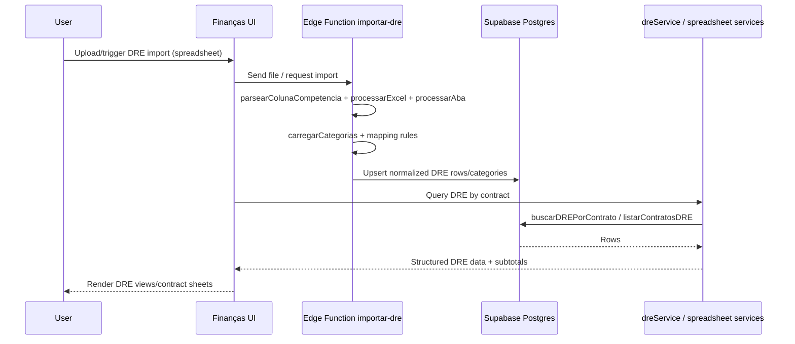

# Data Flow

This document explains how data moves through the **WWS App hub** (React/TypeScript) across modules (**Comercial Público**, **Comercial Privado**, **Finanças**, **TI**, **Qualidade**) and how the application integrates with **Supabase** (Auth + Postgres + Edge Functions) and other external services (e.g., AI chat).

For overall structure and folder responsibilities, see: **[architecture.md](./architecture.md)**.

---

## 1) System overview

### Primary runtime boundaries

- **Browser (React UI)**: pages, components, hooks, state and rendering.
- **Service layer (TypeScript)**: encapsulates reads/writes and external calls; maps raw rows into domain-friendly types.
- **Supabase**:
  - **Auth** (session, permissions)
  - **Postgres** (tables/views as system-of-record)
  - **Edge Functions** (server-side parsing/automation; e.g., DRE import)
- **External providers** (select features): AI chat provider, notification workflows, etc.

### High-level dependency direction

Most features follow a consistent direction:

> **UI → hooks → services → (utils/types) → Supabase (DB/Auth/Edge Functions)**

The reverse flow happens on responses:

> **Supabase → services → UI**

---

## 2) Repository “data flow” building blocks

### UI entry points (React)

- Global pages under: `src/pages/**`
- Shared layout/components: `src/components/**`
- Domain packages:
  - `src/components/Comercialpublico2/**`
  - `src/components/Comercialprivado2/**`
  - `src/modules/financas/**`
  - `src/modules/ti/**`
  - `src/modules/qualidade/**`

UI code is responsible for:
- gathering user input
- calling services
- rendering results and errors
- orchestrating “when” to refetch/refresh

### Hooks

Typical hook responsibilities:
- auth/session and permissions (e.g., `src/hooks/useAuth.ts`)
- UI-friendly data access wrappers (module-specific hooks exist)
- memoization and UI state

### Services (the main “data orchestration” layer)

Shared/core services (examples):
- `src/services/dashboardService.ts` — consolidated dashboard datasets / KPI reads
- `src/services/dreService.ts` — DRE read + computation utilities
  - `buscarDREPorContrato`
  - `listarContratosDRE`
  - internal subtotal logic (e.g., `calcularSubtotais`)
- `src/services/dreSpreadsheetService.ts` — spreadsheet-oriented DRE processing support
- `src/services/aiChatService.ts` — AI chat integration via `ChatMessage[]`

Module-local services (examples):
- **Comercial Público**: `src/components/Comercialpublico2/src/services/**`
  - proposals, employees, challenges, weekly performance, etc.
- **Comercial Privado**: `src/components/Comercialprivado2/src/services/**`
  - actions/comments, goals, challenges, prospection, etc.
  - budgets/orçamentos services under  
    `src/components/Comercialprivado2/src/components/Orçamentos/src/services/**`
- **Finanças**: `src/modules/financas/services/**`
  - contract sheets/analysis, financial KPIs, files/import flows

### Shared types and utilities

- **Typed database row models**: `src/types/database.ts`  
  Used heavily by dashboards/tables to keep reads consistent.
- **Module-specific types**:
  - `src/modules/financas/types.ts`
  - `src/modules/ti/types.ts`
  - `src/modules/qualidade/types.ts`
- **Shared utilities**:
  - `src/lib/**` (contracts/months/currency/date helpers, etc.)
  - module-local utils folders (formatting, sorting, domain helpers)

---

## 3) Core data flow patterns

### 3.1 User-driven CRUD flows (UI → Service → Supabase → UI)

**When used**
- forms, modals, editors, “create/update/delete”, workflow actions

**Flow**
1. User interacts with a component (submit, save, delete, comment).
2. Component calls a service method with an `Insert/Update` payload (common pattern in Comercial modules).
3. Service normalizes/validates input, performs Supabase write.
4. UI updates local state or refetches; feedback is shown (toast, inline error).

**Common UX primitives**
- Toast notifications: `src/components/ui/use-toast.ts`
- Error containment: `src/components/Comercialpublico2/src/components/common/ErrorBoundary.tsx`

**Example (generic pattern)**

```ts
// UI component (pseudo-code)
import { toast } from "@/components/ui/use-toast";
import { proposalService } from "@/components/Comercialpublico2/src/services/proposalService";

async function onSave(input: ProposalInsert) {
  try {
    await proposalService.create(input); // service writes via Supabase
    toast({ title: "Salvo com sucesso" });
    // refetch or update UI state
  } catch (e) {
    toast({ title: "Erro ao salvar", variant: "destructive" });
  }
}
```

> Note: exact function names vary by service; the key pattern is **UI calls service** rather than embedding Supabase calls directly in components.

---

### 3.2 Analytical/aggregated read flows (Dashboards → Service → Supabase/views)

**When used**
- dashboards, KPI pages, charts, summary tables

**Flow**
1. Dashboard page mounts.
2. Service composes read queries (often from views or structured tables).
3. Results are mapped to typed rows from `src/types/database.ts`.
4. UI formats for display (currency, month labels, trends, thresholds).

**Related utilities**
- Month helpers: `src/lib/months.ts` (`getLast12Months`, `formatMonthLabel`, etc.)
- Contract calculations: `src/lib/contractUtils.ts` (e.g., durations, end dates, reminders)

---

### 3.3 Batch import/export flows (File upload → Edge Function/service → DB → UI)

**When used**
- spreadsheet imports (notably **DRE**), large data normalization tasks

**Why Edge Functions**
- Excel parsing is CPU/IO heavy and more reliable server-side.
- Enables idempotent upserts and centralized mapping rules.

**Key DRE import integration**
- Edge Function: `supabase/functions/importar-dre/index.ts`
  - `processarExcel`, `processarAba`
  - `parsearColunaCompetencia`
  - `carregarCategorias`
- Downstream consumers:
  - `src/services/dreService.ts` (`buscarDREPorContrato`, `listarContratosDRE`)
  - Finanças contract sheets and analytics pages

---

## 4) End-to-end diagrams

### 4.1 Typical request lifecycle (read/write)

```mermaid
flowchart LR
  U[User / Browser] --> C[React Components & Pages]
  C --> H[Hooks (useAuth + data hooks)]
  C --> S[Service Layer]
  S --> L[Shared Lib/Utils & Type Mappers]
  S --> SB[(Supabase: Auth + Postgres)]
  S --> EF[Supabase Edge Functions]
  EF --> SB
  SB --> S
  S --> C
  C --> U
```

### 4.2 DRE import (batch) → DRE read (by contract)



---

## 5) Integration surfaces

### 5.1 Supabase (Auth + Database)

**What it provides**
- Authentication and session management in the browser
- Primary persistent store (Postgres)
- RLS policies as authorization enforcement
- Realtime and storage may also exist (depends on feature)

**How it’s typically used**
- Services call Supabase with typed inputs (Insert/Update DTOs) and typed reads (rows from `src/types/database.ts`).
- UI does not directly query the DB in most patterns; it relies on services.

**Common risk**
- **Policy mismatches** (UI can read but cannot write; edge functions unauthorized).  
  Keep RLS policies aligned with module roles and validate with integration tests for critical workflows.

---

### 5.2 Supabase Edge Functions

#### `importar-dre`
- **Location**: `supabase/functions/importar-dre/index.ts`
- **Purpose**: parse DRE spreadsheets and normalize rows into categorized financial records.
- **Key operations**:
  - parse competence/month columns (`parsearColunaCompetencia`)
  - process workbook and tabs (`processarExcel`, `processarAba`)
  - load/map categories (`carregarCategorias`)
- **Recommended design constraints**
  - Idempotent writes via upsert (safe re-runs)
  - Clear error reporting (log rejected rows and header mismatches)
  - Optional: persist an import audit trail (recommended if not already present)

#### Notifications (observed)
- **Location**: `src/components/Comercialpublico2/supabase/functions/notificar_proxima_acao`
- **Role**: event-like side effect after workflow updates (e.g., “next action” reminders).

---

### 5.3 AI chat integration

- **Location**: `src/services/aiChatService.ts`
- **Shape**: `ChatMessage[]` is the primary payload style.
- **Operational guidance**
  - implement timeouts
  - retry selectively (exponential backoff, capped)
  - degrade gracefully (AI should not block core flows)

---

## 6) Cross-module data movement

Although modules are feature-isolated at the UI level, they converge on shared identifiers and shared persistence:

- **Supabase Postgres** acts as the integration substrate across modules.
- Shared identifiers (contract IDs, employee IDs, company IDs) enable cross-feature reporting.
- Shared utilities (e.g., `src/lib/contractUtils.ts`, `src/lib/months.ts`) ensure consistent calculations and labels.

Practical implication for developers:
- Treat the **service layer** as the stable boundary.
- Avoid spreading “schema knowledge” through UI components; keep mapping in services and shared types.

---

## 7) Observability and failure modes (developer checklist)

### What to monitor
- **Client-side**
  - error boundary captures (by route/module)
  - latency for dashboard queries and contract sheets
  - import execution feedback (duration, failures)
- **Supabase**
  - edge function logs/errors (`importar-dre` especially)
  - constraint violations / duplicated rows (indicates non-idempotent import)
  - RLS denials (policy issues)

### Common failure modes and controls
- **Schema/type drift**
  - Control: centralize row typing in `src/types/database.ts`; keep services as the only DB access path.
- **Spreadsheet parsing errors**
  - Control: validate required headers, log rejected rows, unit test parsing helpers if feasible.
- **Partial writes during import**
  - Control: transactional behavior where possible; otherwise checkpointing + idempotent upserts.
- **Permission/policy mismatches**
  - Control: align RLS policies with module roles; test write paths per module.
- **External provider instability (AI)**
  - Control: timeouts + selective retries + graceful fallback.

---

## 8) Related files (quick links)

- Architecture overview: **[docs/architecture.md](./architecture.md)**
- DRE edge function: `supabase/functions/importar-dre/index.ts`
- DRE service: `src/services/dreService.ts`
- DRE spreadsheet support: `src/services/dreSpreadsheetService.ts`
- Dashboard reads: `src/services/dashboardService.ts`
- AI chat: `src/services/aiChatService.ts`
- Typed DB models: `src/types/database.ts`
- Shared contract helpers: `src/lib/contractUtils.ts`
- Shared month helpers: `src/lib/months.ts`
- Error boundary: `src/components/Comercialpublico2/src/components/common/ErrorBoundary.tsx`
- Toast utilities: `src/components/ui/use-toast.ts`
