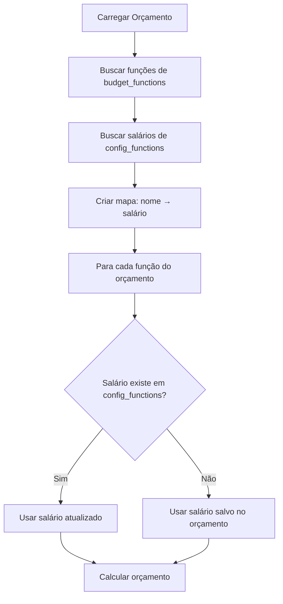

# Correção: Salários atualizados nas Configurações agora refletem nos Orçamentos

## Problema Resolvido

Anteriormente, ao alterar o salário de uma função nas Configurações (por exemplo, alterar Zeladoria de R$ 2.346,84 para R$ 2.351,12), o valor NÃO era refletido nos cálculos dos orçamentos existentes.

## Como Funcionava Antes (Problema)

1. Usuário adicionava uma função ao orçamento
2. Salário era **copiado** de `config_functions` para `budget_functions`
3. Salário ficava **fixo** em `budget_functions`
4. Ao atualizar `config_functions`, o valor em `budget_functions` **não mudava**
5. Cálculos usavam o valor antigo de `budget_functions`

## Como Funciona Agora (Solução)

1. Usuário adiciona uma função ao orçamento
2. Salário é **copiado** de `config_functions` para `budget_functions` (igual antes)
3. Ao carregar o orçamento, o sistema **busca o salário atualizado** de `config_functions`
4. Se encontrar um salário atualizado, **usa o novo valor**
5. Se não encontrar (função foi removida das configurações), **usa o valor salvo** em `budget_functions`

## Fluxo Técnico



## Arquivos Modificados

### `BudgetOverviewTab.tsx`

**Linhas 117-124**: Adicionada busca de salários atualizados
```typescript
// Buscar salários atualizados de config_functions
const { data: configFunctions } = await supabase
  .from('config_functions')
  .select('name, base_salary');

const salaryMap = new Map(
  configFunctions?.map(cf => [cf.name, cf.base_salary]) || []
);
```

**Linhas 196-197 e 234-235**: Usar salário atualizado
```typescript
// Buscar salário atualizado de config_functions, ou usar o salvo no orçamento
const updatedSalary = salaryMap.get(item.function_name) || parseFloatSafe(item.salary, 0);
```

## Como Testar

### Teste 1: Alterar Salário em Configurações

1. Abrir **Configurações** → **Funções**
2. Editar uma função (ex: Zeladoria)
3. Alterar o salário de R$ 2.346,84 para R$ 2.351,12
4. Clicar em Salvar
5. Voltar para a aba **Orçamento Geral**
6. Recarregar a página (Ctrl+Shift+R)
7. Verificar se o novo salário aparece nos cálculos

### Teste 2: Verificar Orçamento por Posto

1. Abrir **Orçamento por Posto**
2. Selecionar a função que teve o salário alterado
3. Verificar se o novo salário aparece na planilha detalhada

### Teste 3: Função Removida das Configurações

1. Adicionar uma função ao orçamento
2. Remover essa função de **Configurações**
3. Recarregar o orçamento
4. Verificar se o orçamento ainda usa o salário antigo (fallback)

## Comportamento Esperado

### Cenário 1: Função Ativa
- Salário sempre reflete o valor atual em `config_functions`
- Mudanças nas configurações aparecem imediatamente nos orçamentos

### Cenário 2: Função Removida
- Orçamento continua funcionando
- Usa o último salário salvo em `budget_functions`
- Evita que orçamentos quebrem se funções forem removidas

## Vantagens da Solução

1. **Consistência**: Todos os orçamentos usam o salário mais recente
2. **Facilidade**: Não precisa atualizar cada orçamento manualmente
3. **Segurança**: Orçamentos não quebram se funções forem removidas
4. **Flexibilidade**: Pode-se manter orçamentos antigos com salários antigos salvando uma cópia da função

## Observações Importantes

- A mudança é **retroativa**: afeta todos os orçamentos existentes
- Se precisar manter um orçamento com salário específico, considere:
  - Criar uma nova função com nome diferente (ex: "Zeladoria - Projeto X")
  - Ou salvar uma cópia do orçamento antes de alterar as configurações

## Impacto

- **Positivo**: Facilita manutenção e garante consistência
- **Cuidado**: Mudanças em configurações afetam todos os orçamentos
- **Recomendação**: Revisar orçamentos após alterar salários nas configurações
